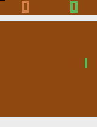
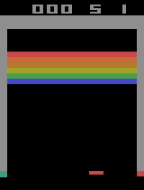

# Atari Reinforcement Learning Agents

## Overview

This repository contains from-scratch PyTorch implementations of Deep Reinforcement Learning agents for classic Atari games. The project leverages the Gymnasium library to provide a standardized interface for training.

The repository includes two agents:
- **Proximal Policy Optimization (PPO)** trained on Pong.
- **Double Deep Q-Network (Double DQN)** trained on Breakout.

These implementations serve as educational examples for building and understanding modern RL algorithms.

## Repository Structure
```
atari_rl/
├── ppo_pong/
│ ├── ppo.py      # Main training script for the PPO agent
│ ├── model.py    # Actor-Critic network architecture
│ └── utils.py    # Environment creation and GIF recording helpers
├── dqn_breakout/
│ ├── breakout.py # Main training script for the DQN agent
│ ├── model.py    # ConvDQN network architecture
│ ├── agent.py    # Double DQN agent logic (including replay buffer)
│ └── utils.py    # Environment creation and GIF recording helpers
├── .gitignore
├── requirements.txt
└── README.md
```
## Installation

Follow these steps to set up the environment and install dependencies.

1. **Clone the repository:**
   ```bash
   git clone https://github.com/YourUserName/Atari_RL.git
   cd Atari_RL
   ```

(Replace YourUserName with your actual GitHub username)

2. **Create and activate a virtual environment:**
This project is tested with uv, Python package installer.

# Create virtual environment

```bash
uv venv
```
# Activate it (on Linux/macOS)
```bash
source .venv/bin/activate
```

3. **Install dependencies:**
PyTorch with CUDA support should be installed separately for best performance.

# Install PyTorch
```bash
uv pip install torch torchvision torchaudio --index-url https://download.pytorch.org/whl/cu121
```
# Install remaining dependencies
```bash
uv pip install -r requirements.txt
```
# How to Train
Once the environment is set up, you can train each agent by running its main script. Training progress, metrics, and results are logged to Weights & Biases.

**Train PPO on Pong:**

Navigate to the project root and run:

```bash
python ppo_pong/ppo.py
```
**Train Double DQN on Breakout:**

Navigate to the project root and run:

```bash
python dqn_breakout/breakout.py
```
Hyperparameters for each run can be modified in the config dictionary at the top of each script.

# Results
Below are links to the training dashboards and example GIFs from successful runs.

**PPO on Pong**

Weights & Biases Run: https://wandb.ai/34237-politechnika-wroc-awska/ppo-pong-atari?nw=nwuser34237

Example Gameplay:



**Double DQN on Breakout**

Weights & Biases Run: https://wandb.ai/34237-politechnika-wroc-awska/dqn-atari-breakout?nw=nwuser34237

Example Gameplay:


